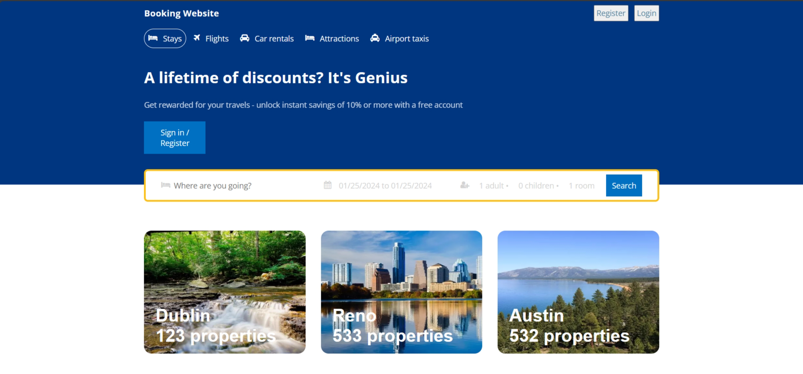

# BOOKING WEBSITE FRONTEND

    

## Introduction

Welcome to [Booking Website](https://booking-website-frontend.vercel.app/) - A place to connect and facilitate the scheduling and reservation process for various activities, events, and services. With a simple yet powerful mission of providing an easy and flexible scheduling experience for users.

## Tech Stack

- ReactJS
- HTML/CSS(SCSS)

## Features 

👉 Home Page: Dynamic home page showcases.

👉 Detail Page: Display detailed room information.

👉 Search Page: Engine-based on-demand search.

Note: There is no function yet, just UI design.

## Quick Start

Follow these steps to set up the project locally on your machine.

**Prerequisites**

Make sure you have the following installed on your machine:

- Git
- Node.js
- npm (Node Package Manager)

**Installation**

Install the project dependencies using npm:

```javascript
npm install
```
**Running the Project**

```javascript
npm run dev
```